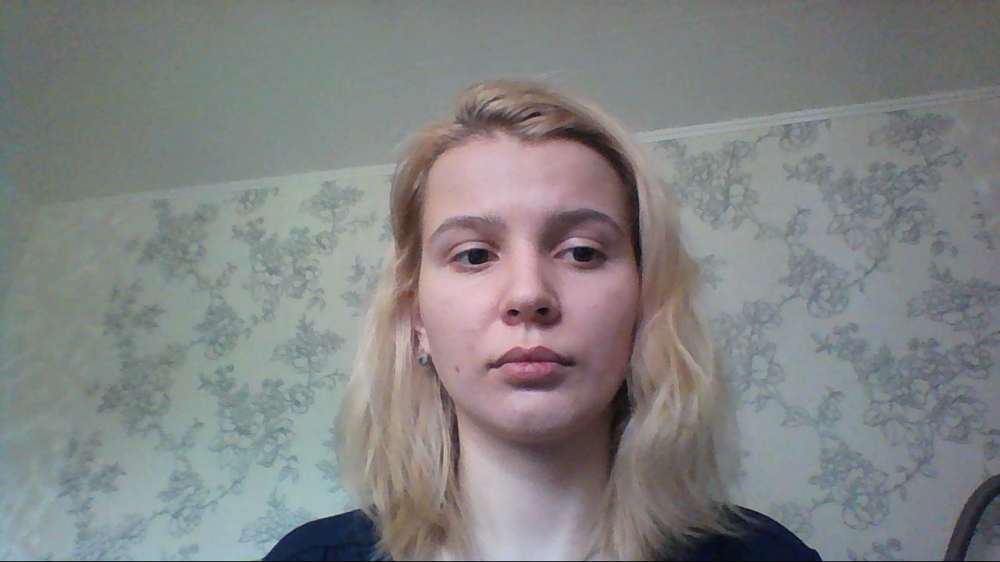
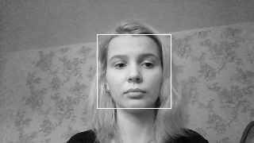
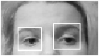
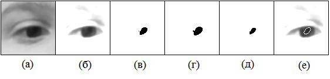

# gaze_tracker
The program performs the user interaction with the computer via a web camera. A self-written algorithm for detecting pupils in the frame and a self-written algorithm for correlating the center of the pupil in the frame with the center of attention on the computer screen are used.

## Structure
The structure of the program consists of four main modules that implement a specific function.

### Calibration module
This module is responsible for displaying the calibration window, managing this window (for example, gradually displaying calibration points), determining the coordinates of the pupil center using the ImageProcessor module at each cycle of work and determining the fixation of the gaze in one place with a specified error.

### ImageProcessor module
The ImageProcessor module implements connection to an available video camera, captures frames from it, as well as their processing and identification of the coordinates of the centers of the pupils.

### View module
The View module, when receiving data from the direction of view from the ImageProcessor module, moves the mouse cursor in the specified direction. When certain signals are received (for example, a signal that the user has fixed a gaze) from the ImageProcessor, the View block will initiate a mouse click in the specified area.

### Controller module
The Controller module controls the rest of the modules.

## Pupil detection results
Original image: 

  Image after resizing and head detection: 

  The result of determining the eyes on a part of the image: 

  An eye image processing process to determine the approximate position of the pupil: 

